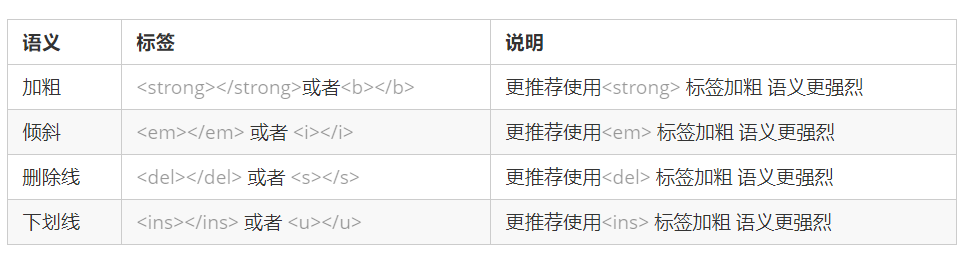
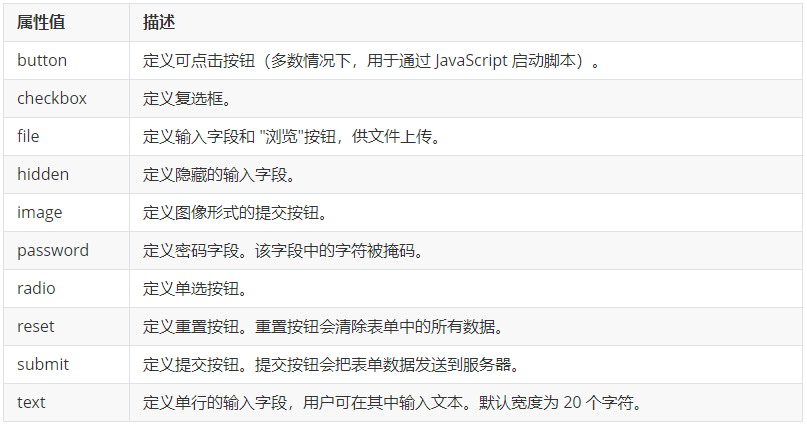

[TOC]

# HTML基础

## 基础

### DOCTYPE

<!DOCTYPE html>  文档类型声明标签,告诉浏览器这个页面采取html5版本来显示页面

### lang 语言种类

用来定义当前文档显示的语言。en定义语言为英语，zh-CN定义语言为中文。简单来说,定义为en 就是英文网页, 定义为 zh-CN 就是中文网页。其实对于文档显示来说，定义成en的文档也可以显示中文，定义成zh-CN的文档也可以显示英文。

### 字符集

字符集 (Character set)是多个字符的集合。以便计算机能够识别和存储各种文字。在<head>标签内，可以通过<meta> 标签的 charset 属性来规定 HTML 文档应该使用哪种字符编码。<meta charset=" UTF-8">。charset 常用的值有：GB2312 、BIG5 、GBK 和 UTF-8，其中 UTF-8 也被称为万国码，基本包含了全世界所有国家需要用到的字符。

## 标签

### 标题标签

​    为了使网页更具有语义化，我们经常会在页面中用到标题标签。HTML 提供了 6 个等级的网页标题，即<h1> - <h6> 。

### 段落标签

在网页中，要把文字有条理地显示出来，就需要将这些文字分段显示。在 HTML 标签中，<p>标签用于定义段落，它可以将整个网页分为若干个段落。

### 换行标签

 在 HTML 中，一个段落中的文字会从左到右依次排列，直到浏览器窗口的右端，然后才自动换行。如果希望某段文本强制换行显示，就需要使用换行标签 <br/>是个单标签。标签只是简单地开始新的一行，跟段落不一样，段落之间会插入一些垂直的间距。

### 文本格式化标签

 在网页中，有时需要为文字设置粗体、斜体 或下划线等效果，这时就需要用到 HTML 中的文本格式化标签，使文字以特殊的方式显示。


### div和span

<div>一行只能放一个。<span>一行上可以多个。

### 图片标签

 在 HTML 标签中， 标签用于定义 HTML 页面中的图像。

```

```

图像标签的其他属性
 

### 路径

#### 相对路径

以引用文件所在位置为参考基础，而建立出的目录路径。 这里简单来说，图片相对于 HTML 页面的位置
 

#### 绝对路径

是指目录下的绝对位置，直接到达目标位置，通常是从盘符开始的路径。
例如，“D:\web\img\logo.gif” 或 完整的网络地址“http://www.itcast.cn/images/logo.gif”

### 链接标签

```
<a href="跳转目标" target="目标窗口的弹出方式">文本或图像</a>
1.href：用于指定链接目标的url地址。值为#时，代表空链接。
2.target:用于指定链接页面的打开方式 _self默认值在本页面中打开 _blank新窗口打开
```

链接分类：
1、外部链接

```
<a href="http://www.baidu.com">百度</a>
```

2、内部链接：网站内部页面之间的相互链接，直接链接内部页面名称即可

```
<a href="index.html">首 </a>
```

3、空链接：如果当时没有确定链接目标时，可以先用空链接

```
<a href="#">首页</a>
```

4、下载链接：如果 href 里面地址是一个文件或者压缩包的话，会下载这个文件。
5、网页元素链接：在网页中的各种网页元素，如文本、图像、表格、音频、视频等都可以添加超链接。
6、锚点链接:  当我们点击链接,可以快速定位到页面中的某个位置。

```
在链接文本的 href 属性中，设置属性值为 #名字 的形式，如<a href="#two">第2集</a> 
找到目标位置标签，里面添加一个 id属性 = 刚才的名字，如：<h3 id="two">第2集介绍</h3>
```

### 注释

如果需要在 HTML 文档中添加一些便于阅读和理解但又不需要显示在页面中的注释文字，就需要使用注释标签。
HTML中的注释以“<!--”开头，以“ -->”结束。

### 特殊字符

在 HTML 页面中，一些特殊的符号很难或者不方便直接使用，此时我们就可以使用下面的字符来替代。
 
重点记住：空格 、大于号、 小于号 这三个， 其余的使用很少，如果需要回头查阅即可。

### 表格

表格不是用来布局页面的，而是用来展示数据的。


```html
         <table>
            <tr>
                <td>单元格内的文字</td>
                ...
            </tr>
            ...
         </table>
```

​    1、<table> </table> 是用于定义表格的标签。
​    2、<tr> </tr> 标签用于定义表格中的行，必须嵌套在 <table> </table>标签中。
​    3、<td> </td> 用于定义表格中的单元格，必须嵌套在<tr></tr>标签中。

#### 表格结构标签

在表格标签中，分别用<thead>标签表示表格的头部区域、<tbody>标签表示表格的主体区域

#### 表头单元格标签

<th> 标签表示 HTML 表格的表头部分(table head 的缩写)。一般表头单元格位于表格的第一行或第一列，表头单元格里面的文本内容加粗居中显示。表头单元格也是单元格，常用于表格第一行突出重要性。

#### 表格属性


#### 合并单元格

**跨行合并**：rowspan="合并单元格的个数" ，最上侧单元格为目标单元格, 写合并代码

**跨列合并**：colspan="合并单元格的个数"，最左侧单元格为目标单元格, 写合并代码

先确定是跨行还是跨列合并，找到目标单元格，写上合并方式 = 合并的单元格数量。

比如：<td colspan="2"></td>。

### 列表

表格是用来显示数据的，列表就是用来布局的。 列表可以分为三大类：无序列表、有序列表和自定义列表。

#### 无序列表

<ul> 标签标志无序列表，列表项使用 <li> 标签定义。

```html
<ul> 
  <li>列表项1</li>   <li>列表项2</li>   <li>列表项3</li>   ... 
</ul>
```

```
<ul></ul> 中只能嵌套 <li></li>，不允许直接在 <ul></ul>标签中输入其他标签或者文字
<li>  </li> 相当于一个容器，可以容纳所有元素。
```

#### 有序列表

<ol> 标签标志有序列表，列表项使用 <li> 标签定义。

```
<ol> 
  <li>列表项1</li>   <li>列表项2</li>   <li>列表项3</li>   ... 
</ol>
```

#### 自定义列表

自定义列表常用于对术语或名词进行解释和描述，定义列表的列表项前没有任何项目符号。<dl> 标签标志自定义列表（描述列表），该标签会与 <dt>（项目名字）和 <dd>（描述）一起使用。

```
<dl>
<dt>名词1</dt> <dd>名词1解释1</dd> <dd>名词1解释2</dd>
</dl>
```

### 表单

使用表单的目的是收集用户信息。

在 HTML 中，一个完整的表单由表单域、表单控件（表单元素）和 提示信息3个部分构成。

#### 表单域

表单域是一个包含表单元素的区域。 在 HTML 标签中， <form> 标签用于定义表单域。

```
<form action=“url地址” method=“提交方式” name=“表单域名称">各种表单元素控件</form>
```


#### 表单元素

表单元素都应该包含在form表单域里，并且有 name 属性。

##### input表单元素

<input> 标签中，包含一个 type 属性，根据不同的 type 属性值，输入字段拥有很多种形式（可以是文本字段、复选框、掩码后的文本控件、单选按钮、按钮等），用来指定不同的控件类型。

<input type="属性值"  />



除 type 属性外，<input>标签还有其他很多属性，其常用属性如下：


**label标签**

<label> 标签用于绑定一个表单元素，当点击<label> 标签内的文本时，浏览器就会自动将焦点(光标)转到或者选择对应的表单元素上，用来增加用户体验。

```
<label for="sex">男</label>
<input type="radio" name="sex" id="sex" />
```

 <label> 标签的 for 属性应当与相关元素的 id 属性相同。

##### select表单元素

在页面中，如果有多个选项让用户选择，并且想要节约页面空间时，可以使用<select>标签控件定义下拉列表。

```
<select>
   <option>选项1</option>
   <option>选项2</option>
   <option>选项3</option>
   ...
 </select>
```

##### textarea表单元素

当用户输入内容较多的情况下，就不能使用文本框表单了，可以使用 <textarea> 标签。<textarea> 标签是用于定义多行文本输入的控件。

```
<textarea rows="3" cols="20">   文本内容 </textarea>
```

通过 <textarea> 标签可以创建多行文本输入框，cols=“每行中的字符数” ，rows=“显示的行数”。
