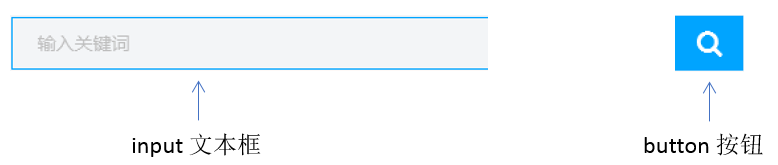
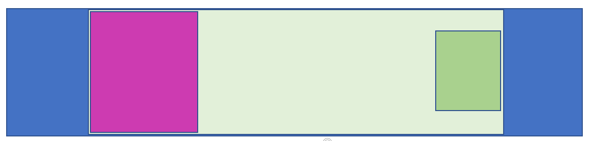

[TOC]

## 学成在线页面制作

页面展示：


学成在线，是典型的企业级网站。

学习学成网的目的，是为了整体感知企业级网站布局流程，带着大家复习以前的知识。


### 1.1.  前期准备素材

- 学成在线PSD源文件
- 开发工具  =  PS（切图） +  sublime（代码） + chrome（测试）

### 1.2.  前期准备工作

先把我们的前期准备工作做好， 我们本次采取结构与样式相分离思想。

1. 创建 study 目录文件夹 (用于存放我们这个页面的相关内容)。

2. 用vscode打开study目录文件夹.

3. study 目录内新建 images 文件夹，用于保存图片。

4. 新建首页文件 index.html（以后我们的网站**首页**统一命名规定为 **index.html** )。

5. 新建 style.css 样式文件。我们本次采用外链样式表。

6. 将样式引入到我们的 HTML 页面文件中。

7. 样式表写入清除内外边距的样式，来检测样式表是否引入成功。

 

### 1.3. 页面布局整体思路

为了提高网页制作的效率，布局时通常有以下的整体思路，具体如下：

​	1.必须确定页面的**版心**（可视区），我们**测量**可得知。

​	2.分析页面中的行模块，以及每个行模块中的列模块。其实页面布局第一准则.

​	3.一行中的列模块经常浮动布局, 先确定每个列的大小,之后确定列的位置.  页面布局第二准则

​	4.制作 HTML 结构。我们还是遵循，先有结构，后有样式的原则。结构永远最重要.

​	5.所以, 先理清楚**布局结构**,再写代码尤为重要. 这需要我们多写多积累.

### 1.4. 页面制作

**确定版心**：

​	这个页面的版心是 1200像素  ，每个版心都要水平居中对齐，所以，我们可以定义版心为公共类：

```css
.w {
    width: 1200px;
    margin: auto;
}
```

#### 1.4.1. header头部制作

**结构图如下：**


- 1号是版心盒子 **header**  1200 *  42 的盒子水平居中对齐, 上下给一个margin值就好了。
- 版心盒子 里面包含 2号盒子 **logo** 图标
- 版心盒子 里面包含 3号盒子 **nav** 导航栏
- 版心盒子 里面包含 4号盒子 **search** 搜索框
- 版心盒子 里面包含 5号盒子 **user** 个人信息
- 注意，要求里面的 **4个子盒子 必须都浮动**


**导航栏注意点:**

实际开发中，**重要的导航栏**，我们不会直接用链接a ，而是**用 li  包含链接(li+a)的做法**

​	1.li+a 语义更清晰，一看这就是有条理的列表型内容。

​	2.如果直接用a，搜索引擎容易辨别为有堆砌关键字嫌疑（故意堆砌关键字容易被搜索引擎有降权的风险），从而影响网站排名

**注意:** 

​	1.让导航栏一行显示, 给 li 加浮动, 因为 li 是块级元素, 需要一行显示.

​	2.这个nav导航栏可以不给宽度,将来可以继续添加其余文字

​	3.因为导航栏里面文字不一样多,所以最好给链接 a 左右padding 撑开盒子,而不是指定宽度 

**4号盒子search的细节：**

​	search 搜索框的意思:  一个 search 大盒子里面包含 2个 表单

​	技巧：input和button都，属于行内块元素，会有缝隙，使用浮动，可以去缝隙。



#### 1.4.2. banner制作

结构图如下：




- 1号盒子是通栏的大盒子**banner**， 不给宽度，给高度，给一个蓝色背景。
- 2号盒子是版心 **w**， 要水平居中对齐。
- 3号盒子版心内，左对齐 **subnav** 侧导航栏。
- 4号盒子版心内，右对齐  **course** 课程。

##### 1.4.2.1  subnav 侧导航栏 (左侧的)

   

- subnav 盒子 背景色 黑色半透明
- 重要的导航栏，li 包 a ，行高45px
- a里面包含文字和span，span右浮动
- 当鼠标经过a ，a里面的内容（文字和span）变蓝色


##### 1.4.2.2  course课程表模块 (右侧的)

结构图如下：

 

- 1号盒子 是  228 * 300 的盒子 右浮动  **注意 浮动的元素 不会有外边距塌陷的问题**
- 1号盒子内 分为 上下 两个 子盒子
- 2号子盒子是 上部分  我们命名为 course-hd    (hd  是  head  的简写 头部的意思，我们经常用)
- 3号子盒子是 下部分  我们命名为 course-bd    (bd  是  body  的简写 主体的意思，我们经常用)

#### 1.4.3. 精品推荐小模块

结构图如下：


- **复习点：**  因为里面三个盒子都要垂直居中，我们利用 继承性，给 最大的盒子 一个垂直居中的代码就好了，还记得 那些 样式可以继承吗？？？ font-  line-  text- color

  

- 大盒子水平居中 goods  精品 ，注意此处有个盒子阴影

- 1号盒子是标题 H3  左侧浮动

- 2号盒子 里面放链接  左侧浮动  goods-item    距离可以控制链接的 左右外边距（注意行内元素只给左右内外边距）

- 3号盒子 右浮动 mod 修改

#### 1.4.4. 精品推荐大模块

结构图如下：


- 1号盒子为最大的盒子 **box**  版心水平居中对齐
- 2号盒子为上面部分 **box-hd**  -- 里面   左侧标题H3 左浮动   右侧 链接 a 右浮动
- 3号盒子为底下部分 **box-bd** --- 里面是无序列表 有 10个 小li 组成
- 小li 外边距的问题， 这里有个小技巧。  给box-hd 宽度为 1215 就可以一行装开5个 li了
- 复习点：我们用到清除浮动，因为 box-hd 里面的盒子个数不一定是多少，所以我们就不给高度了，但是里面的盒子浮动会影响下面的布局，因此需要清除浮动。

#### 1.4.5.  底部模块制作

结构图如下：


- 1号盒子通栏大盒子 底部 **footer**  给高度  底色是白色

- 2号盒子版心水平居中

- 3号盒子版权 **copyright**  左对齐 

- 4号盒子 链接组 **links**  右对齐
