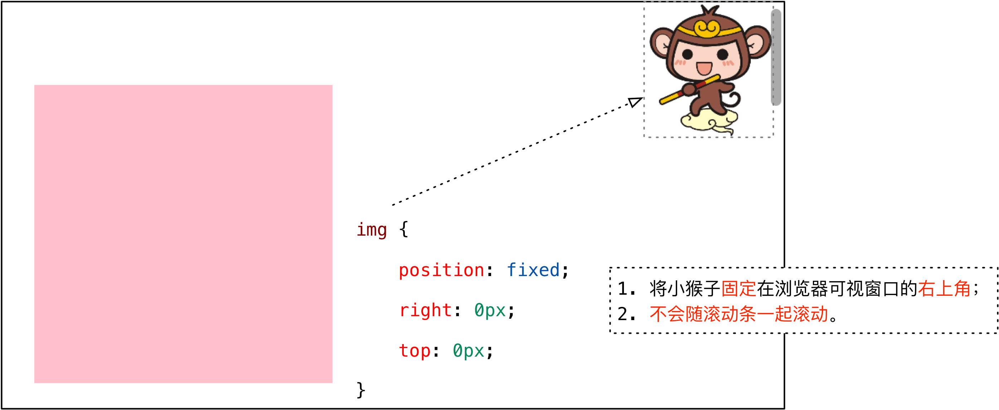
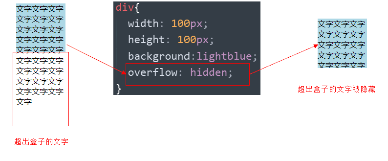

[TOC]

# 定位

## 1. 定位

### 1.1 为什么使用定位

> 我们先来看一个效果，同时思考一下**用标准流或浮动能否实现类似的效果**？

**场景1**： 某个元素可以自由的在一个盒子内移动位置，并且压住其他盒子.


**场景2**：当我们滚动窗口的时候，盒子是固定屏幕某个位置的。


> 结论**：要实现以上效果，**标准流 或 浮动都无法快速实现

定位是可以让盒子自由的在某个盒子内移动位置或者固定屏幕中某个位置，并且可以压住其他盒子。


### 1.2 定位组成

**定位**：将盒子**定**在某一个位置，所以**定位也是在摆放盒子， 用来布局的**

定位有两部分组成：

> **定位 = 定位模式 + 边偏移**  

**定位模式** 用于指定一个元素在文档中的定位方式。**边偏移**则决定了该元素的最终位置。


#### 1.2.1 边偏移

**边偏移** 就是定位的盒子移动到最终位置。有 top、bottom、left 和 right  4 个属性。

| 边偏移属性    | 示例             | 描述                               |
| -------- | :------------- | -------------------------------- |
| `top`    | `top: 80px`    | **顶端**偏移量，定义元素相对于其父元素**上边线的距离**。 |
| `bottom` | `bottom: 80px` | **底部**偏移量，定义元素相对于其父元素**下边线的距离**。 |
| `left`   | `left: 80px`   | **左侧**偏移量，定义元素相对于其父元素**左边线的距离**。 |
| `right`  | `right: 80px`  | **右侧**偏移量，定义元素相对于其父元素**右边线的距离**  |

#### 1.2.2 定位模式

在 CSS 中，通过 `position` 属性定义元素的**定位模式**，语法如下：

```css
选择器 { 
    position: 属性值; 
}
```
| 值         |            语义            |
| ---------- | :------------------------: |
| `static`   | **静态**定位(默认，无定位) |
| `relative` |        **相对**定位        |
| `absolute` |        **绝对**定位        |
| `fixed`    |        **固定**定位        |

### 1.3 定位模式

#### 静态定位(static)

- **静态定位**是元素的**默认**定位方式，**无定位的意思**。它相当于 border 里面的none，静态定位static，不要定位的时候用。

  ```css
  选择器 { 
      position: static; 
  }
  ```

- 静态定位 按照标准流特性摆放位置，它没有边偏移。

#### 相对定位(relative) 

- **相对定位**是元素在移动位置的时候，是相对于它自己**原来的位置**来说的。

```css
选择器 { 
	position: relative; 
}
```

- **原来**的元素在标准流上的**位置**继续占有，后面的盒子仍然以标准流的方式对待它。因此，**相对定位并没有脱标**。

- 效果图：


#### 绝对定位(absolute) 

- **绝对定位**是元素在移动位置的时候，是相对于它**祖先元素**来说的。

  ```
   选择器 { 
   	position: absolute; 
   }
  ```


1. **完全脱标** —— 完全不占位置；  

2. **父元素没有定位**，则以**浏览器**为准定位（Document 文档）。

   

3. **父元素要有定位**

   * 元素将依据最近的已经定位（绝对、固定或相对定位）的父元素（祖先）进行定位。


##### 子绝父相 相对定位经常用来作为绝对定位的父级。

①子级绝对定位，不会占有位置，可以放到父盒子里面的任何一个地方，不会影响其他兄弟盒子。

②父盒子布局时，需要占有位置，因此父亲只能是相对定位，也能限制子盒子在父盒子内显示。

当然，子绝父相不是永远不变的，如果父元素不需要占有位置，**子绝父绝**也可以。

#### 固定定位(fixed) 

- **固定定位**是元素**固定于浏览器可视区的位置**。  在浏览器页面滚动时元素的位置不改变。

  ```
   选择器 { 
   	position: fixed; 
   }
  ```

- 固定定位的特点：

  1.以浏览器的可视窗口为参照点移动元素。

  - 跟父元素没有任何关系
  - 不随滚动条滚动。

  2.固定定位**不在占有原先的位置**。也是**脱标**的


> 固定定位举例：



**提示**：IE 6 等低版本浏览器不支持固定定位。

#### 粘性定位(sticky)

- **粘性定位**可以被认为是相对定位和固定定位的混合。

  ```
   选择器 { 
       position: sticky; 
       top: 10px; 
   }
  ```

- 粘性定位的特点：

  1.以浏览器的可视窗口为参照点移动元素（固定定位特点）

  2.粘性定位占有原先的位置（相对定位特点）

  3.必须添加 top 、left、right、bottom **其中一个**才有效

  跟页面滚动搭配使用。 


#### 定位总结

| **定位模式**          | **是否脱标**         | **移动位置**           | **是否常用**                 |
| --------------------- | -------------------- | ---------------------- | ---------------------------- |
| static   静态定位     | 否                   | 不能使用边偏移         | 很少                         |
| **relative 相对定位** | **否 (占有位置)**    | **相对于自身位置移动** | **基本单独使用**             |
| **absolute绝对定位**  | **是（不占有位置）** | **带有定位的父级**     | **要和定位父级元素搭配使用** |
| **fixed 固定定位**    | **是（不占有位置）** | **浏览器可视区**       | **单独使用，不需要父级**     |
| sticky 粘性定位       | 否   (占有位置)      | 浏览器可视区           | 当前阶段少                   |

1. **边偏移**需要和**定位模式**联合使用，**单独使用无效**；
2. `top` 和 `bottom` 不要同时使用；`left` 和 `right` 不要同时使用。

## 2. 综合案例：学成在线-hot  模块添加

### 2. 1 案例截图：

 

### 2.2 案例分析

1. 一个大的 `li` 中包含 一个课程图片，课程介绍文字信息，还有hot的小图标；
2. hot图片**重叠**在课程图片上面—— 脱标，不占位置，需要使用**绝对定位**；
3. hot图片**重叠**在**li的右上方 —— 需要**使用边偏移确定准确位置。

### 2.3 案例小结

1. **子绝父相** —— **子元素**使用**绝对定位**，**父元素**使用**相对定位**；
2. **与浮动的对比**：
   * **绝对定位**：脱标，**利用边偏移指定准确位置**；
   * **浮动**：脱标，不能指定准确位置，**让多个块级元素在一行显示**。


## 3. 定位(position)的应用

### 3.1.  固定定位小技巧： 固定在版心左侧位置。

小算法：

1.让固定定位的盒子 left: 50%.  走到浏览器可视区（也可以看做版心） 的一半位置。

2.让固定定位的盒子 margin-left: 版心宽度的一半距离。  多走 版心宽度的一半位置

就可以让固定定位的盒子**贴着版心右侧对齐**了。


案例效果：


```html
<style>
        .w {
            width: 800px;
            height: 1400px;
            background-color: pink;
            margin: 0 auto;
        }
        .fixed {
            position: fixed;
            /* 1. 走浏览器宽度的一半 */
            left: 50%;
            /* 2. 利用margin 走版心盒子宽度的一半距离 */
            margin-left: 405px;
            width: 50px;
            height: 150px;
            background-color: skyblue;
        }
    </style>
</head>
<body>
    <div class="fixed"></div>
    <div class="w">版心盒子 800像素</div>
  
</body>
```


### 3.2. 堆叠顺序（z-index）

- 在使用**定位**布局时，可能会**出现盒子重叠的情况**。此时，可以使用 **z-index** 来控制盒子的前后次序 (z轴)

  ```
  选择器 { 
  	z-index: 1; 
  }
  ```

- `z-index` 的特性如下：

  1. **属性值**：**正整数**、**负整数**或 **0**，默认值是 0，数值越大，盒子越靠上；	
  2. 如果**属性值相同**，则按照书写顺序，**后来居上**；
  3. 数字后面**不能加单位**。

  **注意**：`z-index` 只能应用于**相对定位**、**绝对定位**和**固定定位**的元素，其他**标准流**、**浮动**和**静态定位**无效。

- 应用 `z-index` 层叠等级属性可以**调整盒子的堆叠顺序**。如下图所示：


## 4. 定位(position)的拓展

### 4.1 绝对定位的盒子居中

> **注意**：加了**绝对定位/固定定位的盒子**不能通过设置 `margin: 0 auto` 设置**水平居中**。
>
> 但是可以通过以下计算方法实现水平和垂直居中，可以按照下图的方法：


1. `left: 50%;`：让**盒子的左侧**移动到**父级元素的水平中心位置**；
2. `margin-left: -100px;`：让盒子**向左**移动**自身宽度的一半**。


### 4.2 定位特殊特性

绝对定位和固定定位也和浮动类似。

1.行内元素添加绝对或者固定定位，可以直接设置高度和宽度。

2.块级元素添加绝对或者固定定位，如果不给宽度或者高度，默认大小是内容的大小。

### 4.3 脱标的盒子不会触发外边距塌陷

浮动元素、**绝对定位(固定定位）**元素的都不会触发外边距合并的问题。 


### 4.4 绝对定位（固定定位）会完全压住盒子

浮动元素只会压住它下面标准流的盒子，不会压住下面标准流盒子里面的文字，因为发明浮动的目的最初是为了做文字环绕效果的。

但是绝对定位（固定定位） 会压住下面标准流所有的内容。

## 5. 综合案例 - 淘宝轮播图(重点)

### 5.1 效果图


### 5.2 布局分析


### 5.3 步骤

1. 大盒子我们类名为：  tb-promo      淘宝广告

2. 里面先放一张图片。

3. 左右两个按钮 用链接就好了。   左箭头 prev    右箭头  next   

   ​	左按钮样式（border-radius：左上，右上，右下，左下），

   ​	右按钮定位，提取左右按钮共同的样式代码（并集选择器）

4. 底侧小圆点ul 继续做。 类名为 promo-nav     

   ​	中间长方形椭圆 ul的定位（水平居中，离底部15px）  

   ​	长方形需要五个小圆点，ul无序列表，li浮动，椭圆中小圆点的样式


### 5.4 知识点：圆角矩形设置4个角

圆角矩形可以为4个角分别设置圆度， 但是是有顺序的

```
border-top-left-radius:20px;
border-top-right-radius:20px;
border-bottom-right-radius:20px;
border-bottom-left-radius:20px;
```

* 如果4个角，数值相同

  ~~~css
  border-radius: 15px;
  ~~~

* 里面数值不同，我们也可以按照简写的形式，具体格式如下:

~~~css
border-radius: 左上角 右上角  右下角  左下角;
~~~

还是遵循的顺时针。


### 5.5 代码参考

```html
<!DOCTYPE html>
<html lang="en">

<head>
    <meta charset="UTF-8">
    <meta name="viewport" content="width=device-width, initial-scale=1.0">
    <meta http-equiv="X-UA-Compatible" content="ie=edge">
    <title>淘宝轮播图做法</title>
    <style>
        * {
            margin: 0;
            padding: 0;
        }
        li {
            list-style: none;
        }

        .tb-promo {
            position: relative;
            width: 520px;
            height: 280px;
            background-color: pink;
            margin: 100px auto;
        }

        .tb-promo img {
            width: 520px;
            height: 280px;
        }

        /* 并集选择器可以集体声明相同的样式 */
        .prev,
        .next {
            position: absolute;
            /* 绝对定位的盒子垂直居中 */
            top: 50%;
            margin-top: -15px;
            /* 加了绝对定位的盒子可以直接设置高度和宽度 */
            width: 20px;
            height: 30px;
            background: rgba(0, 0, 0, .3);
            text-align: center;
            line-height: 30px;
            color: #fff;
            text-decoration: none;
        }

        .prev {
            left: 0;
            /* border-radius: 15px; */
            border-top-right-radius: 15px;
            border-bottom-right-radius: 15px;
        }

        .next {
            /* 如果一个盒子既有left属性也有right属性，则默认会执行 left属性 同理  top  bottom  会执行 top */
            right: 0;
            /* border-radius: 15px; */
            border-top-left-radius: 15px;
            border-bottom-left-radius: 15px;
        }
        .promo-nav {
            position: absolute;
            bottom: 15px;
            left: 50%;
            margin-left: -35px;
            width: 70px;
            height: 13px;
            /* background-color: pink; */
            background: rgba(255,255,255, .3);
            border-radius: 7px;
        }
        .promo-nav li {
            float: left;
            width: 8px;
            height: 8px;
            background-color: #fff;
            border-radius: 50%;
            margin: 3px;
        }
        /* 不要忘记选择器权重的问题 */
       .promo-nav .selected {
            background-color: #ff5000;
        }
    </style>
</head>

<body>
    <div class="tb-promo">
        
        <!-- 左侧按钮箭头 -->
        <a href="#" class="prev"> &lt; </a>
        <!-- 右侧按钮箭头 -->
        <a href="#" class="next"> &gt; </a>
        <!-- 小圆点 -->
        <ul class="promo-nav">
            <li class="selected"></li>
            <li></li>
            <li></li>
            <li></li>
            <li></li>
        </ul>
    </div>
</body>

</html>
```


## 6. 元素的显示与隐藏

- 目的（本质）让一个元素在页面中消失或者显示出来

- 场景：类似网站广告，当我们点击关闭就不见了，但是我们重新刷新页面，会重新出现！


### 7.1. display 显示（重点）

- display 设置对象是否及如何显示。

  ```
  display: none 隐藏对象
  
  display：block 除了转换为块级元素之外，同时还有显示元素的意思。
  ```

- display 隐藏元素后，**不再占**有原来的位置。

- 后面应用及其广泛，搭配 JS 可以做很多的网页特效。

  > 配合后面js做特效，比如下拉菜单，原先没有，鼠标经过，显示下拉菜单， 应用极为广泛


### 7.2. visibility 可见性 

- visibility 属性用于指定一个元素应可见还是隐藏。

  ```
  visibility：visible ; 　元素可视
  
  visibility：hidden; 　  元素隐藏
  ```

- **visibility 隐藏元素后，继续占有原来的位置**。

- 如果隐藏元素想要原来位置， 就用 visibility：hidden

- 如果隐藏元素不想要原来位置， 就用 display：none  (用处更多 重点）


### 7.3. overflow 溢出

- overflow 属性指定了如果内容溢出一个元素的框（超过其指定高度及宽度） 时，会发生什么。

| 属性值              | 描述                                       |
| ------------------- | ------------------------------------------ |
| **visible**（默认） | 不剪切内容也不添加滚动条                   |
| **hidden**          | 不显示超过对象尺寸的内容，超出的部分隐藏掉 |
| **scroll**          | 不管超出内容否，总是显示滚动条             |
| **auto**            | 超出自动显示滚动条，不超出不显示滚动条     |

-  一般情况下，我们都不想让溢出的内容显示出来，因为溢出的部分会影响布局。
- 但是如果有定位的盒子， 请慎用overflow:hidden  因为它会隐藏多余的部分。




### 7.4. 显示与隐藏总结

| 属性                           | 区别                   | 用途                                                         |
| ------------------------------ | ---------------------- | ------------------------------------------------------------ |
| **display 显示     （重点）**  | 隐藏对象，不保留位置   | 配合后面js做特效，比如下拉菜单，原先没有，鼠标经过，显示下拉菜单， 应用极为广泛 |
| **visibility 可见性 （了解）** | 隐藏对象，保留位置     | 使用较少                                                     |
| **overflow 溢出（重点）**      | 只是隐藏超出大小的部分 | 1. 可以清除浮动  2. 保证盒子里面的内容不会超出该盒子范围     |

## 8 综合案例：土豆网鼠标经过显示遮罩

### 8.1. 效果图


### 8.2. 案例目标

1.练习元素的显示与隐藏

2.练习元素的定位

### 8.3. 核心原理

原先半透明的黑色遮罩看不见， 鼠标经过 大盒子，就显示出来。

遮罩的盒子不占有位置， 就需要用绝对定位 和 display  配合使用。

### 8.4. 代码参考

```html
<!DOCTYPE html>
<html lang="en">

<head>
    <meta charset="UTF-8">
    <meta name="viewport" content="width=device-width, initial-scale=1.0">
    <meta http-equiv="X-UA-Compatible" content="ie=edge">
    <title>仿土豆网显示隐藏遮罩案例</title>
    <style>
        .tudou {
            position: relative;
            width: 444px;
            height: 320px;
            background-color: pink;
            margin: 30px auto;
        }

        .tudou img {
            width: 100%;
            height: 100%;
        }

        .mask {
            /* 隐藏遮罩层 */
            display: none;
            position: absolute;
            top: 0;
            left: 0;
            width: 100%;
            height: 100%;
            background: rgba(0, 0, 0, .4) url(images/arr.png) no-repeat center;
        }

        /* 当我们鼠标经过了 土豆这个盒子，就让里面遮罩层显示出来 */
        .tudou:hover .mask {
            /* 而是显示元素 */
            display: block;
        }
    </style>
</head>

<body>
    <div class="tudou">
        <div class="mask"></div>
        
    </div>
    <div class="tudou">
        <div class="mask"></div>
        
    </div>
    <div class="tudou">
        <div class="mask"></div>
        
    </div>
    <div class="tudou">
        <div class="mask"></div>
        
    </div>
</body>

</html>
```

