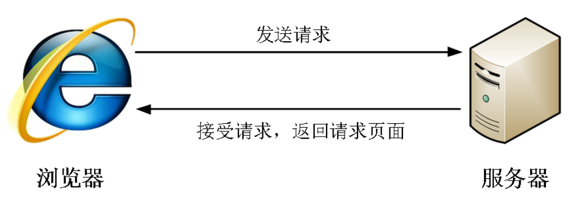

[TOC]

# 精灵图和字体图标

## 1. 精灵图

### 1.1 为什么需要精灵图



一个网页中往往会应用很多小的背景图像作为修饰，当网页中的图像过多时，服务器就会频繁地接收和发送请求图片，造成服务器请求压力过大，这将大大降低页面的加载速度。

**使用精灵图可以有效地减少服务器接收和发送请求的次数**，**提高**页面的**加载速度**

**核心原理**：

​	将网页中的一些小背景图像整合到一张大图中 ，这样服务器只需要一次请求就可以了。

**精灵图举例**:


### 1.2 精灵图的使用

1. 精灵技术主要针对于背景图片使用。就是把多个小背景图片整合到一张大图片中。
3. 想要在某个盒子里用某个小背景图片作为背景，就是移动这个大图片，调整位置到小背景图片出现在盒子里。，而盒子不会显示大图片其余的内容。
4. 移动背景图片位置， 此时可以使用 background-position 。移动的距离就是这个目标图片的 x 和 y 坐标。注意网页中的坐标有所不同

### 1.3 案例：拼出自己名字

#### 1.3.1 案例效果


#### 1.3.2 代码参考

结构

```html
<span class="p">p</span>
<span class="i">i</span>
<span class="n">n</span>
<span class="k">k</span>
```

样式

```css
span {
    display: inline-block;
    background: url(images/abcd.jpg) no-repeat;
}
.p {
    width: 100px;
    height: 112px;
    /* background-color: pink; */
    background-position:  -493px -276px;
}
.i {
    width: 60px;
    height: 108px;
    /* background-color: pink; */
    background-position: -327px -142px;
}
.n {
    width: 108px;
    height: 109px;
    /* background-color: pink; */
    background-position: -215px -141px;
}
.k {
    width: 105px;
    height: 114px;
    /* background-color: pink; */
    background-position: -495px -142px;
}
```

## 2. 字体图标

### 2.1 字体图标的产生

字体图标使用场景：  主要用于显示网页中通用、常用的一些小图标。

精灵图有缺点：图片本身放大和缩小会失真，一旦图片制作完毕想要更换非常复杂。

**字体图标 iconfont**很好的解决了以上问题

**字体图标**可以为前端工程师提供一种方便高效的图标使用方式，**展示的是图标，本质属于字体**。

### 2.2 字体图标的优点

**轻量级**：一个图标字体要比一系列的图像要小。一旦字体加载了，图标就会马上渲染出来，减少了服务器请求

- 灵活性：本质其实是文字，可以很随意的改变颜色、产生阴影、透明效果、旋转等
- 兼容性：几乎支持所有的浏览器，请放心使用
- 注意： 字体图标不能替代精灵技术，只是对工作中图标部分技术的提升和优化。

**总结：**

1.如果遇到一些结构和样式比较简单的小图标，就用字体图标。

2.如果遇到一些结构和样式复杂一点的小图片，就用精灵图。


### 2.3 字体图标的下载

- **icomoon** **字库**  http://icomoon.io  

- **阿里** **iconfont** **字库**   http://www.iconfont.cn/  

### 2.4字体图标的引入

**下载完毕之后，注意原先的文件不要删，后面会用**。

1. 把下载包里面的 **fonts** 文件夹放入页面根目录下


* **字体文件格式**

不同浏览器所支持的字体格式是不一样的，字体图标之所以兼容，就是因为包含了主流浏览器支持的字体文件。

1).TureType(  **.ttf**  )格式.ttf字体是Windows和Mac的最常见的字体，支持这种字体的浏览器有IE9+、Firefox3.5+、Chrome4+、Safari3+、Opera10+、iOS Mobile、Safari4.2+；

2).Web Open Font Format( **.woff** )格式woff字体，支持这种字体的浏览器有IE9+、Firefox3.5+、Chrome6+、Safari3.6+、Opera11.1+；

3).Embedded Open Type( **.eot** )格式.eot字体是IE专用字体，支持这种字体的浏览器有IE4+；

4).SVG(  .**svg**  )格式.svg字体是基于SVG字体渲染的一种格式，支持这种字体的浏览器有Chrome4+、Safari3.1+、Opera10.0+、iOS Mobile Safari3.2+；


2.在 CSS 样式中全局声明字体： 简单理解把这些字体文件通过css引入到我们页面中。

一定注意字体文件路径的问题

```
 @font-face {
   font-family: 'icomoon';
   src:  url('fonts/icomoon.eot?7kkyc2');
   src:  url('fonts/icomoon.eot?7kkyc2#iefix') format('embedded-opentype'),
     url('fonts/icomoon.ttf?7kkyc2') format('truetype'),
     url('fonts/icomoon.woff?7kkyc2') format('woff'),
     url('fonts/icomoon.svg?7kkyc2#icomoon') format('svg');
   font-weight: normal;
   font-style: normal;
 }

```


3. html 标签内添加小图标。


4. 给标签定义字体。

  ```
   span {
     font-family: "icomoon";
   }
  ```

  注意：务必保证 这个字体和上面@font-face里面的字体保持一致 

  

### 2.5 字体图标的追加

如果工作中，原来的字体图标不够用了，我们需要添加新的字体图标到原来的字体文件中。

把压缩包里面的 **selection.json** 从新上传，然后选中自己想要新的图标，从新下载压缩包，并替换原来的文件即可。


