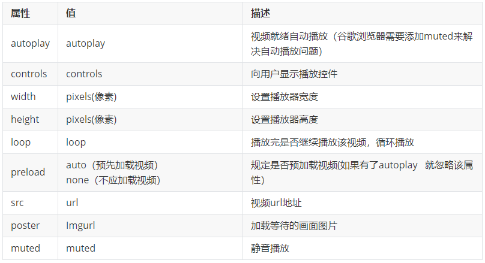
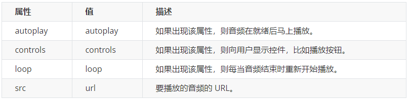
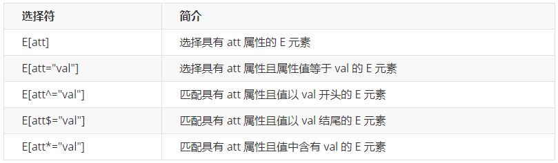
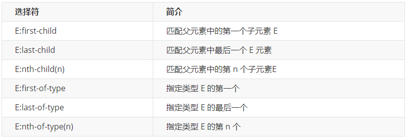
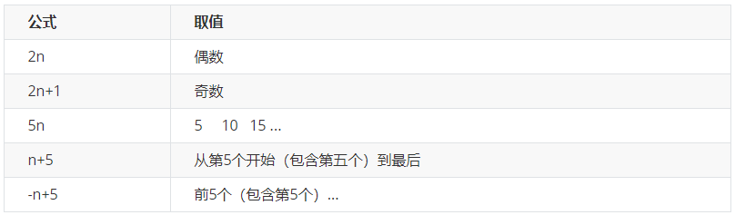
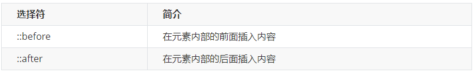
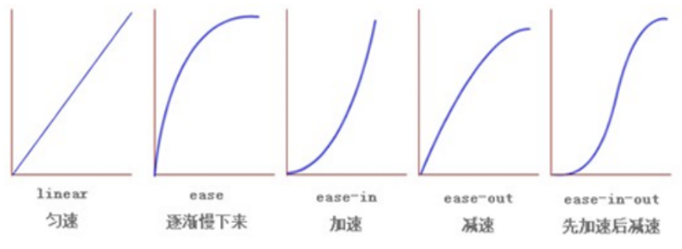
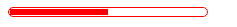

[TOC]

# HTML5新特性

## 概述

HTML5 的新增特性主要是针对于以前的不足，增加了一些新的标签、新的表单和新的表单属性等。 

这些新特性都有兼容性问题，基本是 **IE9+ 以上版本的浏览器**才支持，如果不考虑兼容性问题，可以大量使用这些新特性。

## 语义化标签

以前布局，我们基本用 div 来做。div 对于搜索引擎来说，是没有语义的

```html
<div class=“header”> </div>
<div class=“nav”> </div>
<div class=“content”> </div>
<div class=“footer”> </div>
```

发展到了HTML5后，新增了一些语义化标签，这样的话更加有利于浏览器的搜索引擎搜索，也方便了网站的seo（Search Engine Optimization，搜索引擎优化），下面就是新增的一些语义化标签

- `<header>` 头部标签
- `<nav>` 导航标签
- `<article>` 内容标签
- `<section>` 定义文档某个区域
- `<aside>` 侧边栏标签
- `<footer>` 尾部标签


## 多媒体标签

多媒体标签分为 音频 **audio** 和视频 **video**两个标签，使用它们可以很方便的在页面中嵌入音频和视频，而不再去使用落后的flash。

多媒体标签的 属性、方法、事件比较多，因此我们需要什么功能的时候，就需要去查找相关的文档进行学习使用。


### 视频标签- video

当前 **<video>** 元素支持三种视频格式： 尽量使用 **mp4格式**

**使用语法：**

```html
 <video src="media/mi.mp4"></video>
```


#### 兼容写法

由于各个浏览器的支持情况不同，所以我们会有一种兼容性的写法，这种写法了解一下即可

```html
<video  controls="controls"  width="300">
    <source src="move.ogg" type="video/ogg" >
    <source src="move.mp4" type="video/mp4" >
    您的浏览器暂不支持 <video> 标签播放视频
</ video >
```
**上面这种写法，浏览器会匹配video标签中的source，如果支持就播放，如果不支持往下匹配，直到没有匹配的格式，就提示文本**

#### video 常用属性



**属性很多，有一些属性需要大家重点掌握：**

- `autoplay`  自动播放
  - 注意： 在google浏览器上面，默认禁止了自动播放，如果想要自动播放的效果，需要设置 muted属性
- `width`  宽度
- `height`  高度
- `loop`  循环播放
- `src`  播放源
- `muted` 静音播放，并能解决谷歌浏览器禁止自动播放的问题

**示例代码：**

```html
<video src="media/mi.mp4" autoplay="autoplay" muted="muted"  loop="loop" poster="media/mi9.jpg"></video>
```

### 音频标签- audio

当前 **<audio>** 元素支持三种视频格式： 尽量使用 **mp3格式**

**使用语法：**

```html
<audio src="media/music.mp3"></audio>
```


#### 兼容写法

由于各个浏览器的支持情况不同，所以我们会有一种兼容性的写法，这种写法了解一下即可

```html
< audio controls="controls"  >
    <source src="happy.mp3" type="audio/mpeg" >
    <source src="happy.ogg" type="audio/ogg" >
    您的浏览器暂不支持 <audio> 标签。
</ audio>
```

**上面这种写法，浏览器会匹配audio标签中的source，如果支持就播放，如果不支持往下匹配，直到没有匹配的格式，就提示文本**

#### audio 常用属性



**示例代码：**

```html
<audio src="media/music.mp3" autoplay="autoplay" controls="controls"></audio>
```

### 小结

- 谷歌浏览器把音频和视频自动播放禁止了
- 我们可以给视频标签添加 muted 属性来静音播放视频，音频不可以（可以通过JavaScript解决）

## 新增的表单元素 

在H5中，帮我们新增加了很多类型的表单，这样方便了程序员的开发

**课堂案例：在这个案例中，熟练了新增表单的用法**


**案例代码：**

```html
<!-- 我们验证的时候必须添加form表单域 -->
<form action="">
    <ul>
        <li>邮箱: <input type="email" /></li>
        <li>网址: <input type="url" /></li>
        <li>日期: <input type="date" /></li>
        <li>时间: <input type="time" /></li>
        <li>数量: <input type="number" /></li>
        <li>手机号码: <input type="tel" /></li>
        <li>搜索: <input type="search" /></li>
        <li>颜色: <input type="color" /></li>
        <!-- 当我们点击提交按钮就可以验证表单了 -->
        <li> <input type="submit" value="提交"></li>
    </ul>
</form>
```

 **常见输入类型**

```
text password radio checkbox button file hidden submit reset image
```

**新的输入类型**


# CSS3新特性

## CSS3  新增选择器 

CSS3 给我们新增了选择器，可以更加便捷，更加自由的选择目标元素。 

- 属性选择器
- 结构伪类选择器
- 伪元素选择器

### 属性选择器

属性选择器，按照字面意思，都是根据标签中的属性来选择元素



**示例代码：**

```css
 /* 只选择 type =text 文本框的input 选取出来 */
input[type=text] {
    color: pink;
}
/* 选择首先是div 然后 具有class属性 并且属性值 必须是 icon开头的这些元素 */
div[class^=icon] {
    color: red;
}
/* 选择首先是section 然后 具有class属性 并且属性值 必须是 data结尾的这些元素 */
section[class$=data] {
    color: blue;
}
```

### 结构伪类选择器

结构伪类选择器主要根据文档结构来选择器元素， 常用于根据父级选择器里面的子元素



#### E:first-child

匹配父元素的第一个子元素E

```html
 <style>
    ul li:first-child{
      background-color: red;
    }
  </style>

  <ul>
    <li>列表项一</li>
    <li>列表项二</li>
    <li>列表项三</li>
    <li>列表项四</li>
  </ul>
```


**E:last-child**  则是选择到了最后一个li标签

#### E:nth-child(n)

匹配到父元素的第n个元素

- 匹配到父元素的第2个子元素  

  `ul li:nth-child(2){}`

- 匹配到父元素的序号为奇数的子元素

  `ul li:nth-child(odd){}`    **odd** 是关键字  奇数的意思（3个字母 ）

- 匹配到父元素的序号为偶数的子元素

  `ul li:nth-child(even){}`   **even**（4个字母 ）

- **匹配到父元素的前3个子元素**

  `ul li:nth-child(-n+3){}`    

  选择器中的  **n** 是怎么变化的呢？

  因为 n是从 0 ，1，2，3.. 一直递增

  所以 -n+3 就变成了   

  - n=0 时   -0+3=3
  - n=1时    -1+3=2
  - n=2时    -2+3=1
  - n=3时    -3+3=0 
  - ...

**一些常用的公式： 公式不是死的，在这里列举出来让大家能够找寻到这个模式，能够理解代码，这样才能写出满足自己功能需求的代码**



**常用的结构伪类选择器是：** `nth-child(n) {...}`

#### E:nth-child 与 E:nth-of-type 的区别

这里只讲明  **E:nth-child(n)**  和 **E:nth-of-type(n)**  的区别  剩下的 **E:first-of-type**     **E:last-of-type**  **E:nth-last-of-type(n)**   同理做推导即可

```html
<style>
    ul li:nth-child(2){
      /* 字体变成红色 */
        color: red;
    }

    ul li:nth-of-type(2){
      /* 背景变成绿色 */
      background-color: green;
    }
  </style>


  <ul>
    <li>列表项一</li>
    <p>乱来的p标签</p>
    <li>列表项二</li>
    <li>列表项三</li>
    <li>列表项四</li>
  </ul>
```


也就是说：

- `E:nth-child(n)`    对父元素里面所有孩子排序选择，匹配第n个子元素E，然后看看是否和E匹配
- `E:nth-of-type(n)` 对父元素里面指定类型的子元素进行排序选择，匹配同类型中的第n个同级兄弟元素E。

#### 小结

- 结构伪类选择器一般用于选择父级里面的第几个孩子
- nth-child 对父元素里面所有孩子排序选择，先找到第n个孩子，然后看看是否和E匹配
- nth-of-type 按照指定类型，对父元素里面的指定类型子元素进行排序，然后再找第n个孩子
- 关于 nth-child（n） 我们要知道 n 是从 0 开始计算的

### 伪元素选择器

伪元素选择器可以帮助我们利用CSS创建新标签元素，而不需要HTML标签，从而简化HTML结构



**示例demo**

```html
<style>
    div {
        width: 200px;
        height: 200px;
        background-color: pink;
    }
    /* div::before 权重是2 */
    div::before {
        /* 这个content是必须要写的 */
        content: '我';
    }
    div::after {
        content: '小猪佩奇';
    }
</style>
<body>
    <div>
        是
    </div>
</body>
```

注意：

- before 和 after 创建的元素是行内元素
- 新创建的这个元素在文档树中是找不到的，所以我们称为伪元素
- before 和 after 必须有 content 属性 
- before 在父元素内容的前面创建元素，after 在父元素内容的后面插入元素

#### 应用场景一： 字体图标

在实际工作中，字体图标基本上都是用伪元素来实现的，好处在于我们不需要在结构中额外去定义字体图标的标签，通过content属性来设置字体图标的编码

**步骤：**

- 结构中定义div盒子
- 在style中先申明字体  @font-face
- 在style中定义after伪元素 div::after{...}
- 在after伪元素中 设置content属性，属性的值就是字体编码。并设置font-family的属性。
- 利用定位的方式，让伪元素定位到相应的位置；记住定位口诀：子绝父相

```html
<head>
    ...
    <style>
        @font-face {
            font-family: 'icomoon';
            src: url('fonts/icomoon.eot?1lv3na');
            src: url('fonts/icomoon.eot?1lv3na#iefix') format('embedded-opentype'),
                url('fonts/icomoon.ttf?1lv3na') format('truetype'),
                url('fonts/icomoon.woff?1lv3na') format('woff'),
                url('fonts/icomoon.svg?1lv3na#icomoon') format('svg');
            font-weight: normal;
            font-style: normal;
            font-display: block;
        }
        div {
            position: relative;
            width: 200px;
            height: 35px;
            border: 1px solid red;
        }

        div::after {
            position: absolute;
            top: 10px;
            right: 10px;
            font-family: 'icomoon';
            /* content: ''; */
            content: '\e91e';
            color: red;
            font-size: 18px;
        }
    </style>
</head>
<body>
    <div></div>
</body>
```


#### 应用场景二：盒子遮罩效果

**步骤：**

- 在style中，给大的div盒子，设置 before伪元素
- 这个伪元素充当的是遮罩的角色，所以我们不用设置内容，但是需要设置content属性，属性的值为空字符串
- 给这个遮罩设置宽高，背景颜色，默认是隐藏的
- 当鼠标移入到 div盒子时候，让遮罩显示，利用 hover 来实现

```html
<head>
    ...
    <style>
        .tudou {
            position: relative;
            width: 444px;
            height: 320px;
            background-color: pink;
            margin: 30px auto;
        }

        .tudou img {
            width: 100%;
            height: 100%;
        }

        .tudou::before {
            content: '';
            /* 隐藏遮罩层 */
            display: none;
            position: absolute;
            top: 0;
            left: 0;
            width: 100%;
            height: 100%;
            background: rgba(0, 0, 0, .4) url(images/arr.png) no-repeat center;
        }

        /* 当我们鼠标经过了 土豆这个盒子，就让里面before遮罩层显示出来 */
        .tudou:hover::before {
            /* 而是显示元素 */
            display: block;
        }
    </style>
</head>

<body>
    <div class="tudou">
        
    </div>
    <div class="tudou">
        
    </div>
    <div class="tudou">
        
    </div>
    <div class="tudou">
        
    </div>
</body>
```

## 盒子模型

CSS3 中可以通过box-sizing 来指定盒模型，有2个值： content-box、border-box，这样计算盒子大小的方式就发生了改变

- box-sizing: content-box  盒子大小为 width + padding + border  （以前默认的）
- box-sizing: border-box  盒子大小为 width

如果盒子模型改为了box-sizing: border-box  ， 那padding和border就不会撑大盒子了（前提padding和border不会超过width宽度）

## 其他特性

### 模糊-滤镜filter

filter CSS属性将模糊或颜色偏移等图形效果应用于元素

```css
filter:   函数(); -->  例如： filter: blur(5px);  -->  blur模糊处理  数值越大越模糊
```


### calc计算函数

calc() 此CSS函数让你在声明CSS属性值时执行一些计算

```css
width: calc(100% - 80px);
```

括号里面可以使用 + - *  / 来进行计算

### CSS3 过渡

在不使用 Flash 或 JavaScript 的情况下，过渡可以当元素从一种样式变换为另一种样式时为这个过程添加效果，且不会影响页面布局。

```css
transition: 要过渡的属性  花费时间  运动曲线  何时开始;
```

- 属性 ： 想要变化的 css 属性， 宽度高度 背景颜色 内外边距都可以 。如果想要所有的属性都变化过渡， 写一个all 就可以
- 花费时间： 单位是 秒（必须写单位） 比如 0.5s 
- 运动曲线： 默认是 ease （可以省略）
- 何时开始：延迟触发时间，单位是 秒（必须写单位）  默认是 0s  （可以省略）
- **记住过渡的使用口诀： 谁做过渡给谁加**



#### 过渡练习



- 创建两个div的盒子，属于的嵌套关系，外层类名叫 bar，里层类名叫 bar_in
- 给外层的bar 这个盒子设置边框，宽高，圆角边框
- 给里层的bar_in  设置 初始的宽度，背景颜色，过渡效果
- 给外层的 bar 添加 hover事件，当触发了hover事件 让里层的bar_in 来进行宽度的变化

代码：

```html
<head>
    ...
    <style>
        .bar {
            width: 150px;
            height: 15px;
            border: 1px solid red;
            border-radius: 7px;
            padding: 1px;
        }
        .bar_in {
            width: 50%;
            height: 100%;
            background-color: red;
            /* 谁做过渡给谁加 */
            transition: all .7s;
        }
        .bar:hover .bar_in {
            width: 100%;
        }
    </style>
</head>
<body>
    <div class="bar">
        <div class="bar_in"></div>
    </div>
</body>
```

### 背景颜色线性渐变

 background: -webkit-linear-gradient(起始方向, 颜色1, 颜色2, ...);

背景颜色线性渐变必须添加浏览器私有前缀（比如-webkit-）

 background: -webkit-linear-gradient(left, red , blue); 

background: -webkit-linear-gradient(left top, red , blue);
